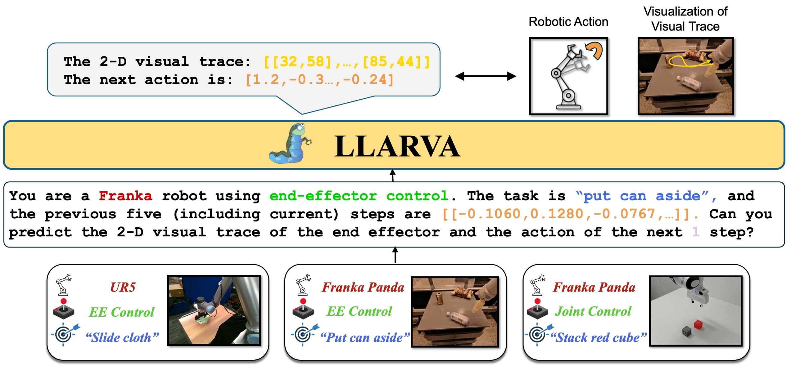
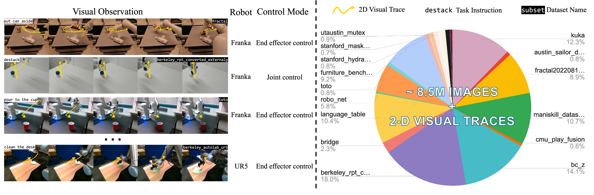

##   LLARVA: Vision-Action Instruction Tuning Enhances Robot Learning

In recent years, instruction-tuned Large Multimodal Models (LMMs) have been successful at several tasks, including image captioning and visual question answering; yet leveraging these models remains an open question for robotics. Prior LMMs for robotics applications have been extensively trained on language and action data, but their ability to generalize in different settings has often been less than desired. To address this, we introduce LLARVA, a model trained with a novel instruction tuning method that leverages structured prompts to unify a range of robotic learning tasks, scenarios, and environments. Additionally, we show that predicting intermediate 2-D representations, which we refer to as "visual traces", can help further align vision and action spaces for robot learning. We generate 8.5M image-visual trace pairs from the Open X-Embodiment dataset in order to pre-train our model, and we evaluate on 12 different tasks in the RLBench simulator as well as a physical Franka Emika Panda 7-DoF robot. Our experiments yield strong performance, demonstrating that LLARVA---using 2-D and language representations---performs well compared to several contemporary baselines, and can generalize across various robot environments and configurations.
<p align="center">  </p>

> [**LLARVA: Vision-Action Instruction Tuning Enhances Robot Learning**](https://llarva24.github.io/)            
> [Dantong Niu*](https://scholar.google.com/citations?user=AzlUrvUAAAAJ&hl=en), Yuvan Sharma*, [Gicard Biamby](https://scholar.google.com/citations?user=s0Fof5IAAAAJ&hl=en), [Jerome Quenum](https://people.eecs.berkeley.edu/~jquenum/), [Yutong Bai](https://yutongbai.com/), [Biafeng Shi](https://bfshi.github.io/),
> [Trevor Darrell†](https://people.eecs.berkeley.edu/~trevor/), [Roei Herzig†](https://roeiherz.github.io/)      
> Berkeley AI Research, UC Berkeley    

[comment]: <> (> CVPR 2024    )

[project page](https://llarva24.github.io/) | [arxiv](https://arxiv.org/abs/2312.17243) | [bibtex](#citation)


## Vision-Action Tuning Dataset
<p align="center">  </p>
For the pre-training of LLARVA, we generate 8.5M image-visual trace pairs from the Open X-Embodiment (OXE) dataset. Our dataset consists of images from a diverse collection of 37 OXE subsets with 13 different robots, including a wide assortment of tasks, environments, cameras (and thus images), and end-effectors, among other factors. For each image in an episode, we calculate the 2-D visual trace of the end-effector 
. For this purpose, we use a bounding box detector that is trained specifically on each of the different end-effectors in OXE.


## License
LLARVA is licensed under the [Apache](LICENSE), however portions of the project are available under separate license terms: CutLER, Detectron2 and DINO are licensed under the CC-BY-NC license; TokenCut, Bilateral Solver and CRF are licensed under the MIT license; If you later add other third party code, please keep this license info updated, and please let us know if that component is licensed under something other than CC-BY-NC, MIT, or CC0.


## How to get support from us?
If you have any general questions, feel free to email us at [Dantong Niu](mailto:bias_88@berkeley.edu)). If you have code or implementation-related questions, please feel free to send emails to us or open an issue in this codebase (We recommend that you open an issue in this codebase, because your questions may help others). 

## Citation
If you find our work inspiring or use our codebase in your research, please consider giving a star ⭐ and a citation.
```
@misc{?,
      title={?}, 
      author={?},
      year={2023},
      eprint={2312.17243},
      archivePrefix={arXiv},
      primaryClass={cs.CV}
}
```


