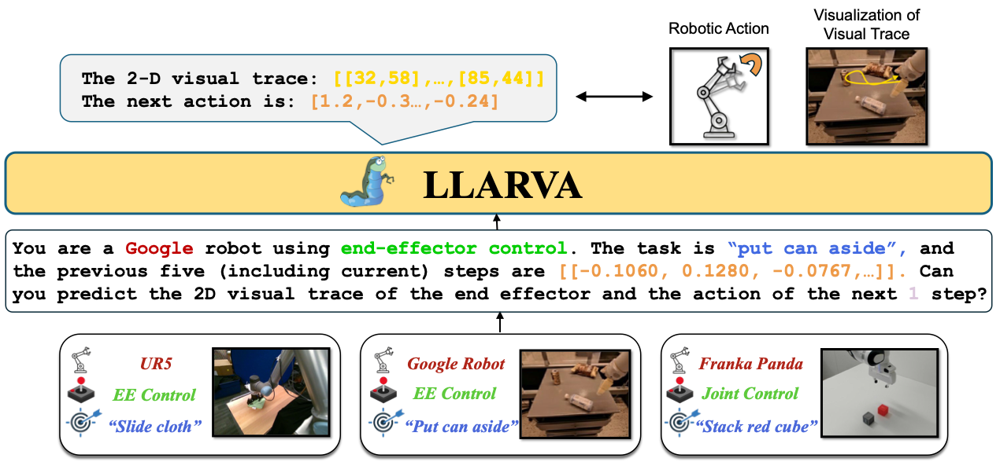

##   LLARVA: Vision-Action Instruction Tuning Enhances Robot Learning

In recent years, instruction-tuned Large Multimodal Models (LMMs) have been successful at several tasks, including image captioning and visual question answering; yet leveraging these models remains an open question for robotics. Prior LMMs for robotics applications have been extensively trained on language and action data, but their ability to generalize in different settings has often been less than desired. To address this, we introduce LLARVA, a model trained with a novel instruction tuning method that leverages structured prompts to unify a range of robotic learning tasks, scenarios, and environments. Additionally, we show that predicting intermediate 2-D representations, which we refer to as "visual traces", can help further align vision and action spaces for robot learning. We generate 8.5M image-visual trace pairs from the Open X-Embodiment dataset in order to pre-train our model, and we evaluate on 12 different tasks in the RLBench simulator as well as a physical Franka Emika Panda 7-DoF robot. Our experiments yield strong performance, demonstrating that LLARVA---using 2-D and language representations---performs well compared to several contemporary baselines, and can generalize across various robot environments and configurations.
<p align="center">  </p>

> [**LLARVA: Vision-Action Instruction Tuning Enhances Robot Learning**](https://llarva24.github.io/)            
> [Dantong Niu*](https://scholar.google.com/citations?user=AzlUrvUAAAAJ&hl=en), Yuvan Sharma*, [Gicard Biamby](https://scholar.google.com/citations?user=s0Fof5IAAAAJ&hl=en), [Jerome Quenum](https://people.eecs.berkeley.edu/~jquenum/), [Yutong Bai](https://yutongbai.com/), [Biafeng Shi](https://bfshi.github.io/),
> [Trevor Darrell†](https://people.eecs.berkeley.edu/~trevor/), [Roei Herzig†](https://roeiherz.github.io/)      
> Berkeley AI Research, UC Berkeley    
> CoRL 2024

[project page](https://llarva24.github.io/) | [arxiv](https://arxiv.org/abs/2312.17243) | [bibtex](#citation)


## Release

- [2024/10/19] 🔥 Release the instruction tuning Dataset of **LLARVA**. Including 8.5M image-visual trace pairs from [OXE](https://github.com/google-deepmind/open_x_embodiment).
Release our [End-Effector Detector](https://github.com/Dantong88/Gripper_detector). 
- [2024/10/20] 🔥 Release the vision-action instruction pre-training/tuning model. Release instruction to reproduce results on simulation.


## Vision-Action Tuning Dataset
See [DATASET.md](https://github.com/Dantong88/LLARVA/blob/main/docs/DATASET.md).

## Vision-Action Instruction Pre-training
See [Vision-Action Instruction Pre-training.md](https://github.com/Dantong88/LLARVA/blob/main/docs/Vision-Action_Instruction_Pre-training.md).

## Vision-Action Instruction Tuning
For this part, we release full instruction to reproduce the results of simulation on [RLBench Benchmark](https://github.com/stepjam/RLBench). See
[Vision-Action Instruction Tuning.md](https://github.com/Dantong88/LLARVA/blob/main/docs/Vision-Action_Instruction_Pre-training.md).


## License
LLARVA is licensed under the [Apache](LICENSE), If you later add other third party code, please keep this license info updated, and please let us know if that component is licensed under something other than CC-BY-NC, MIT, or CC0.


## How to get support from us?
If you have any general questions, feel free to email us at [Dantong Niu](mailto:bias_88@berkeley.edu), [Yuvan Sharma](mailto:yuvan@berkeley.edu). If you have code or implementation-related questions, please feel free to send emails to us or open an issue in this codebase (We recommend that you open an issue in this codebase, because your questions may help others). 

## Citation
If you find our work inspiring or use our codebase in your research, please consider giving a star ⭐ and a citation.
```
@misc{niu2024llarva,
      title={LLARVA: Vision-Action Instruction Tuning Enhances Robot Learning}, 
      author={Dantong Niu and Yuvan Sharma and Giscard Biamby and Jerome Quenum and Yutong Bai and Baifeng Shi and Trevor Darrell and Roei Herzig},
      year={2024}
}
```


