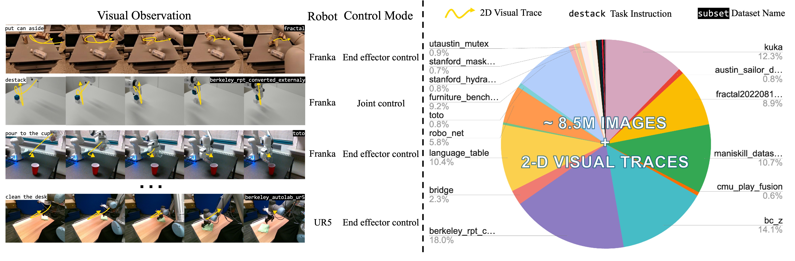

## Vision-Action Tuning Dataset
<p align="center">  </p>
For the pre-training of LLARVA, we generate 8.5M image-visual trace pairs from the Open X-Embodiment (OXE) dataset. Our dataset consists of images from a diverse collection of 37 OXE subsets with 13 different robots, including a wide assortment of tasks, environments, cameras (and thus images), and end-effectors, among other factors. For each image in an episode, we calculate the 2-D visual trace of the end-effector 
. For this purpose, we use a bounding box detector that is trained specifically on each of the different end-effectors in OXE.


### Instruction Tuning Dataset
We release our pre-training annotations built on top of [Open-X Embodiment](https://github.com/google-deepmind/open_x_embodiment). We extract the [RLDS](https://github.com/google-research/rlds#dataset-format) format
demonstrations and transfer them to the annotation format using in [LLaVA](https://github.com/haotian-liu/LLaVA/blob/main/docs/Data.md). You can download the [images.tar.gz](https://drive.google.com/file/d/1M6DEuU8pQ9n94lcjKIxQuIFPMx0NXJiE/view?usp=sharing) and the instruction tuning json file [train/validation annotations](https://drive.google.com/drive/folders/1du-MdMQfL5x-lsjnQ9ig1b5ddxxl8xR0?usp=sharing). The instruction tuning data format:

```angular2html
train/val.json
│ 
└── image-instruction pair 1
│   ├── conversations 
│   │   ├── human 
│   │   │   └── (A string. Instruction from human, including conditions like robot type, robot state, task and ask agent to predict n step action and visual traces.)
│   │   │
│   │   └── gpt
│   │       └── (A string. Answers from agent for the predicted actions and visual traces.)
│   │
│   └── image
│   │   └── (A string. Image path.)
│   │
│   └── id 
│       └── (A int. Annotation index.)         
│
└── image-instruction pair 2
    ... 
```

If you want to adapt your own dataset to instruction tuning format, you may need to run our end-effector detector to get the visual
traces. The detector is built on [detectron2](https://github.com/facebookresearch/detectron2), we are happy to also release the detector and weights below. 


### End-effector Detector

The usage of the end-effector, please see [Gripper_detector](https://github.com/Dantong88/Gripper_detector).

